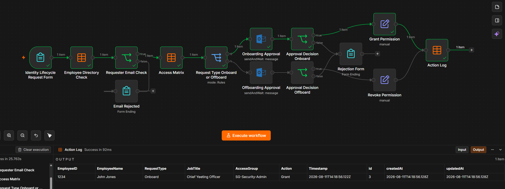

# IAM Joiner/Leaver Automation — v1

An Identity and Access Management (IAM) workflow built in n8n to model and automate an employee Joiner and Leaver access lifecycle.

The workflow validates employee information, determines required access using role-based access rules, requests manager approval, routes approved requests through the appropriate Grant or Revoke path, and records the outcome in an audit log.

> **Note:** All employee identities, roles and access data used in this project are fictional and were created specifically for demonstration purposes. No production or employer data is used.

---

## Why I Built This

Identity lifecycle processes involve repetitive tasks that can become time-consuming and prone to inconsistent access decisions when handled manually.

I built this project to explore how Joiner and Leaver processes could be automated while maintaining important IAM controls such as role-based access, manager approval and auditability.

The project is also an opportunity for me to develop practical workflow automation skills and explore how automation can be integrated with identity platforms.

---

## Workflow

The current workflow follows this process:

1. Receive employee lifecycle information.
2. Validate the employee against the employee directory.
3. Determine required access based on the employee's role.
4. Send the access request for manager approval.
5. Process the approval decision.
6. Route the approved request based on the lifecycle event:
   - **Joiner** → Grant Access
   - **Leaver** → Revoke Access
7. Record the result in an IAM audit log.

📄 [View n8n Workflow JSON](workflow/IAM-Joiner-Leaver-Workflow.json)

### Workflow Overview

*Figure 1: n8n workflow showing employee validation, RBAC access lookup, manager approval, Joiner/Leaver routing and audit logging.*

---

## How It Works

### 1. Employee Directory

I created a fictional employee directory containing the information required by the workflow to process an identity request.

The directory contains employee attributes such as:

- Employee name
- Employee ID
- Department
- Job role
- Manager
- Employment status

The workflow uses this information to validate the employee and determine which access rules should apply.

📄 [View Employee Directory](data/Employee-Directory.csv)

---

### 2. RBAC Access Matrix

I created an access matrix that maps job roles to the systems and permissions required for that role.

Instead of manually selecting access for each employee, the workflow uses the employee's role to determine the appropriate access.

This represents a simplified Role-Based Access Control (RBAC) model and helps make access assignments consistent and repeatable.

📄 [View RBAC Access Matrix](data/Access-Matrix.csv)

---

### 3. Employee Validation

When a Joiner or Leaver request enters the workflow, the employee information is checked against the employee directory.

The workflow uses the directory as its source of employee information before continuing with the access lookup and approval process.

---

### 4. Access Lookup

Once the employee has been validated, their job role is used to query the RBAC access matrix.

The workflow retrieves the access associated with that role and uses the result to build the access request.

This removes the need to manually determine the required access for each request.

---

### 5. Manager Approval

The proposed access change is sent for manager approval before the workflow continues.

This introduces an approval control between the access request and the provisioning decision.

If the request is rejected, the access change does not proceed through the Grant or Revoke path.

---

### 6. Joiner / Leaver Decision

Approved requests are routed based on the lifecycle event.

**Joiner**

→ The workflow follows the **Grant Access** path.

**Leaver**

→ The workflow follows the **Revoke Access** path.

The current version simulates these provisioning and deprovisioning actions rather than making changes to a production identity provider.

---

### 7. Audit Logging

The workflow records the outcome of each identity request in an IAM audit log.

The log provides a record of the access decision and workflow activity, allowing completed Joiner and Leaver requests to be traced after processing.

This demonstrates how logging can be incorporated into an automated identity lifecycle process to support accountability and auditing.

📄 [View IAM Audit Log](data/iam-audit-log.csv)
---

## IAM & Security Controls

The workflow was designed around several IAM principles:

- Joiner and Leaver lifecycle management
- Role-Based Access Control (RBAC)
- Manager approval before access changes
- Least-privilege access assignment
- Structured access provisioning and deprovisioning
- Audit logging and traceability
- Repeatable access decisions based on defined role mappings

---

## Technologies & Concepts

- n8n
- Identity & Access Management (IAM)
- Joiner/Leaver lifecycle management
- Role-Based Access Control (RBAC)
- Workflow automation
- Approval workflows
- Conditional workflow logic
- Audit logging

---

## Current Limitations

This project is currently a proof of concept.

The **Grant Access** and **Revoke Access** stages represent provisioning and deprovisioning actions within the workflow. They do not currently make changes to a production identity platform.

The employee directory and RBAC access matrix contain fictional test data created specifically for this project.

---

## Planned Improvements

The next major stage of the project is to integrate the workflow with **Microsoft Entra ID using Microsoft Graph**.

Planned improvements include:

- Microsoft Graph API integration
- Entra ID group assignment and removal
- Automated provisioning and deprovisioning
- Verification of access changes
- Improved error handling
- Failed-action logging and alerts
- Duplicate request handling
- Mover lifecycle support
- Improved audit information

### Planned v2 Architecture

Request  
↓  
Employee Validation  
↓  
RBAC Access Lookup  
↓  
Manager Approval  
↓  
Joiner / Leaver Decision  
↓  
Microsoft Graph API  
↓  
Microsoft Entra ID  
↓  
Verify Access Change  
↓  
Audit Log

---

## What I Learned

Building this project gave me practical experience translating an IAM lifecycle process into an automated workflow.

It required me to think about how employee information moves through an identity process, how role-based access decisions can be standardised, where approval controls should exist, and how identity actions can be recorded for auditing.

I also gained hands-on experience building conditional workflows in n8n, working with structured data and designing an automation around IAM requirements rather than simply automating individual tasks.

The project has provided a foundation for the next stage: connecting the workflow to Microsoft Entra ID through Microsoft Graph and performing actual identity and access changes.
