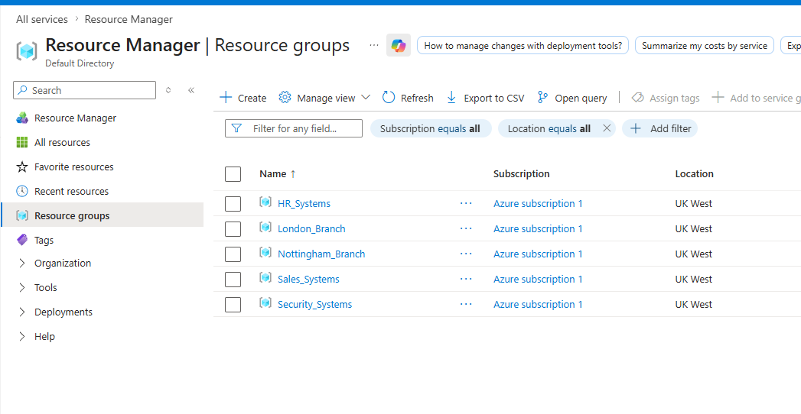
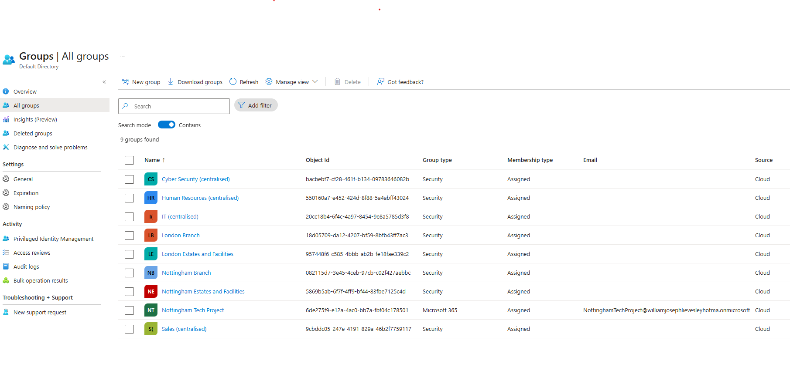
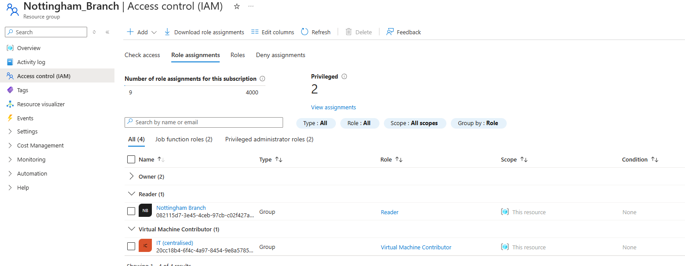
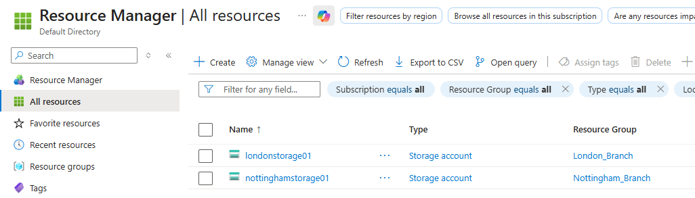

# Hybrid Identity & Azure RBAC Lab

Enterprise-style Microsoft Entra ID and Azure RBAC lab designed to simulate branch-based access governance, role inheritance and least-privilege administration.

---

# Objectives

- Configure Microsoft Entra security groups
- Implement Azure RBAC
- Simulate branch-based access governance
- Understand RBAC inheritance and scope
- Implement least-privilege access control
- Deploy Azure resources for RBAC testing

---

# Environment Overview

## Resource Groups

- London_Branch
- Nottingham_Branch

## Security Groups

- London_Branch
- Nottingham_Branch
- IT (centralised)

## Resources

- Azure Storage Accounts
- Branch-based RBAC assignments

---

# Key Concepts Demonstrated

- Azure RBAC
- Microsoft Entra security groups
- Least-privilege access control
- Role inheritance
- Scoped administration
- Branch-based resource segmentation
- Group-based administrative access

---

# Resource Groups

Branch-based Azure Resource Groups used to simulate infrastructure segmentation and RBAC scope boundaries.

---

# Security Groups

Microsoft Entra security groups used to implement branch-based and administrative access control.

---

# RBAC Assignments

Configured Azure RBAC assignments using group-based inheritance and least-privilege principles.

### RBAC Structure

| Group | Role | Scope | Role Description |
|---|---|---|---|
| London_Branch | Reader | London_Branch | Standard London branch users inherit read-only visibility to resources inside the London branch resource group. Users can inspect resources and configurations but cannot modify infrastructure. |
| Nottingham_Branch | Reader | Nottingham_Branch | Standard Nottingham branch users inherit read-only visibility to resources inside the Nottingham branch resource group. Users can inspect resources and configurations but cannot modify infrastructure. |
| IT (centralised) | Virtual Machine Contributor | Both branches | Centralised IT administrators inherit elevated infrastructure permissions across both branch resource groups. Users in this group can manage virtual machines and related infrastructure resources without receiving full ownership or RBAC administration privileges.|

---

# Storage Resources

Azure Storage Accounts deployed within branch resource groups to demonstrate RBAC inheritance and scoped resource access.

---

# IAM Design Logic

The environment was designed using layered RBAC principles:

- Branch groups provide scoped visibility to branch resources
- Administrative groups inherit elevated infrastructure permissions
- Permissions are assigned to groups rather than individual users
- Access inheritance is controlled through Microsoft Entra security groups

This approach improves scalability, governance consistency and least-privilege enforcement.

---

# Issues Encountered

- Understanding Azure RBAC scope inheritance
- Distinguishing Microsoft Entra roles from Azure RBAC permissions
- Designing branch vs department-based access models
- Managing overlapping inherited permissions
- Navigating differences between Azure Portal and Microsoft Entra Admin Center

---

# Future Improvements

- Conditional Access policies
- MFA enforcement
- Hybrid Active Directory integration
- Intune device management
- Privileged Identity Management (PIM)
- Additional branch infrastructure resources
