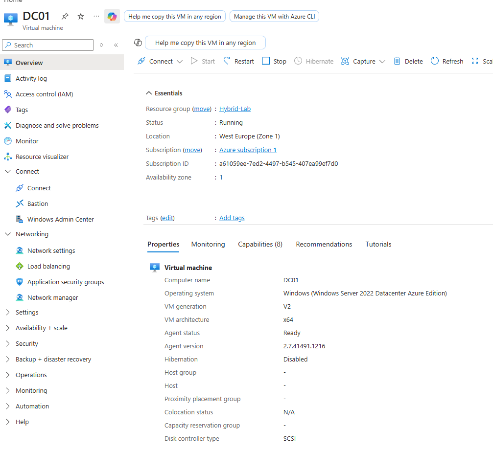
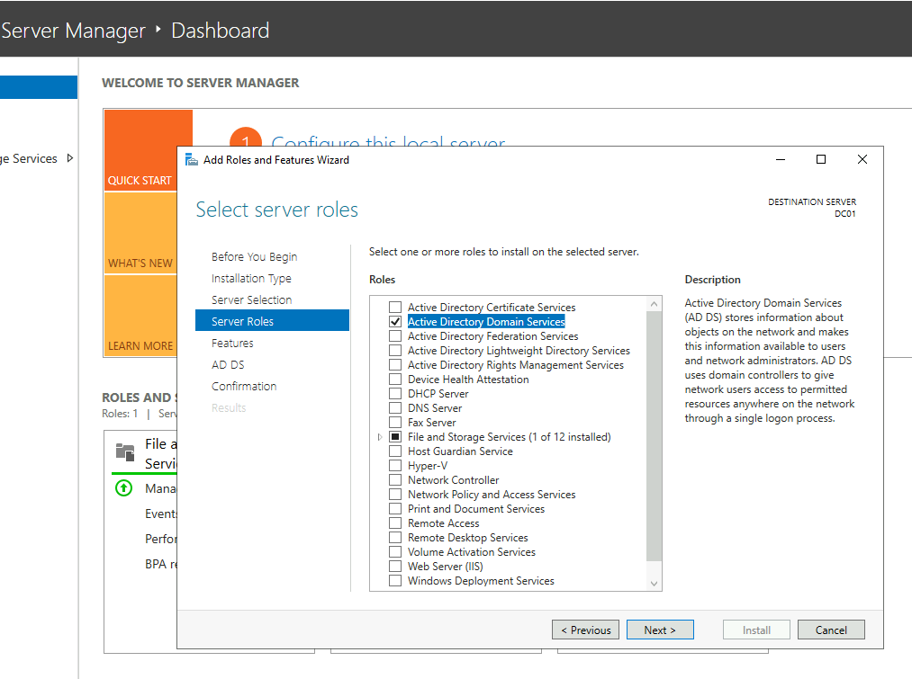
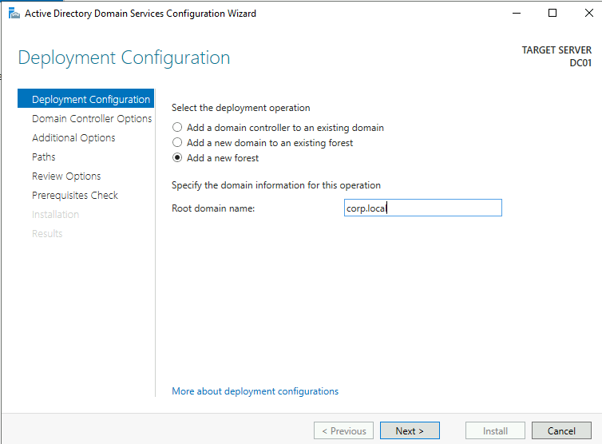
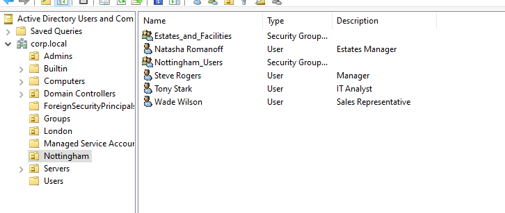
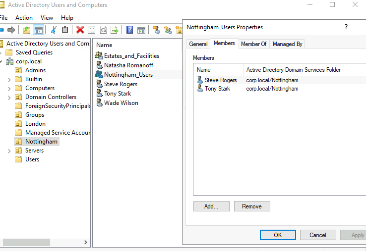
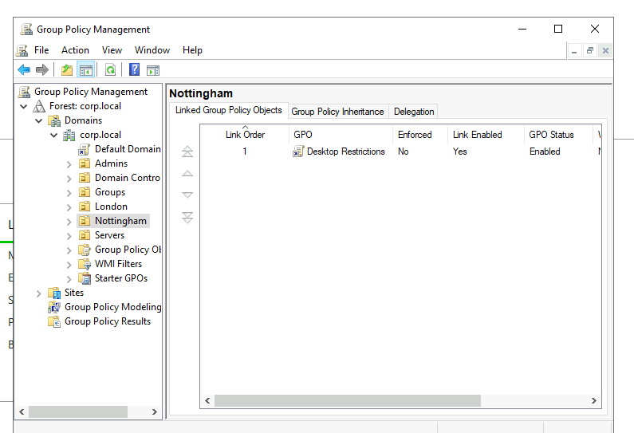
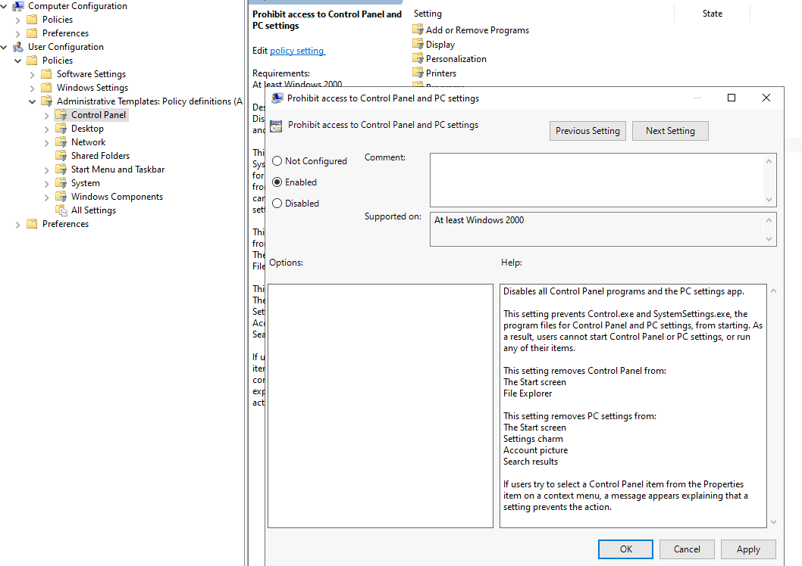

# Active Directory Deployment

Configured a Windows Server 2022 Domain Controller within Azure to simulate on-premises enterprise identity infrastructure and hybrid identity foundations.

---

# Objectives

- Deploy Windows Server infrastructure in Azure
- Install Active Directory Domain Services (AD DS)
- Promote a server to a Domain Controller
- Create an Active Directory forest and domain
- Begin organisational identity structure planning

---
# Windows Server Deployment

Deployed a Windows Server 2022 Datacenter: Azure Edition virtual machine within Azure to simulate on-premises enterprise identity infrastructure and hybrid identity foundations.

### VM Configuration

| Setting | Value |
|---|---|
| VM Name | DC01 |
| OS | Windows Server 2022 Datacenter: Azure Edition |
| Region | West Europe |
| VM Size | B2ts_v2 |
| Role | Domain Controller |
# Environment Overview

---

# Active Directory Installation

Installed the Active Directory Domain Services server role using Server Manager.

---

# Domain Controller Promotion

Promoted the Windows Server VM to a Domain Controller and created a new Active Directory forest using the `corp.local` domain.

---

# Key Concepts Demonstrated

- Active Directory Domain Services
- Domain Controller deployment
- Enterprise identity infrastructure
- Windows Server administration
- Hybrid identity foundations
- Identity governance architecture

---

# Issues Encountered

- Azure VM connectivity and RDP configuration
- Azure region quota limitations
- Understanding Active Directory deployment stages
- DNS delegation warnings during domain promotion

---

# Active Directory Users and Groups

Created domain users and security groups within Active Directory to simulate enterprise identity governance and role-based administration.

### Example Objects

#### Users
- Steve Rogers
- Natasha Romanoff
- Wade Wilson

#### Security Groups
- Nottingham_Users
- IT_Admins

### Key Concepts Demonstrated

- Group-based identity governance
- Centralised user management
- Security group administration
- Organisational identity structure
- Active Directory object management

# Group-Membership

Assigned users to appropriate security groups to simulate scalable role-based access control and centralized identity governance.

# GPO Linked

Created and linked a Group Policy Object (GPO) to the Nottingham organisational unit to simulate centralized user environment management and policy enforcement.

# Group Policy

### Policy Demonstrated

- Prohibit access to Control Panel and PC settings

### Key Concepts Demonstrated

- Group Policy Objects (GPOs)
- OU-linked policy inheritance
- Centralized administration
- User environment restrictions
